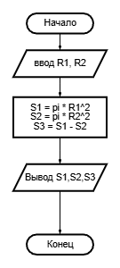
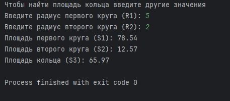
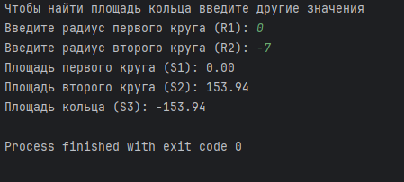
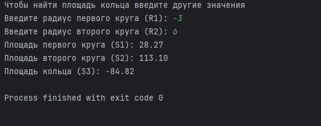

# Практическая работа №1 #  

### Тема: создание линейных приложений ###

### Цель: получить навыки создание линейных приложений ###

#### Ход работы ####

##### Задача: #####

> Даны два круга с общим центром и радиусами R1 и R2 (R1 > R2). Найти площадь этих кругов
> S1 и S2, а также площадь S3 кольца, внешний радиус которого равен R1, а внутренний радиус равен R2:

##### Контрольный пример: #####

> Ввожу число 5 и 2, получаю 78.54; 12.57; 65.97  
> Ввожу число 0 и -7, получаю 0; 153.94; -153.94  
> Ввожу число -3 и 6, получаю 28.27; 113.10; -84.82

##### Системный анализ: #####

> Входные данные: 'float R1,R2'  
> Выходные данные: 'float S1,S2,S3'

##### Блок схема: #####



##### Код программы: #####

```python
print("Чтобы найти площадь кольца введите другие значения")
import math

# Ввод радиусов
R1 = float(input("Введите радиус первого круга (R1): "))
R2 = float(input("Введите радиус второго круга (R2): "))

# Площадь первого круга
S1 = math.pi * (R1 ** 2)

# Площадь второго круга
S2 = math.pi * (R2 ** 2)

# Площадь кольца
S3 = S1 - S2

# Вывод результатов
print(f"Площадь первого круга (S1): {S1:.2f}")
print(f"Площадь второго круга (S2): {S2:.2f}")
print(f"Площадь кольца (S3): {S3:.2f}")
```

##### Результат работы программы: #####

* Вводим число `5 и 2`  
  
* Вводим число `0 и -7`
  
* Вводим число `-3 и 6`
  

##### Выыод по проделанной работе: #####

> Я молодец :) Я справился с этой работой